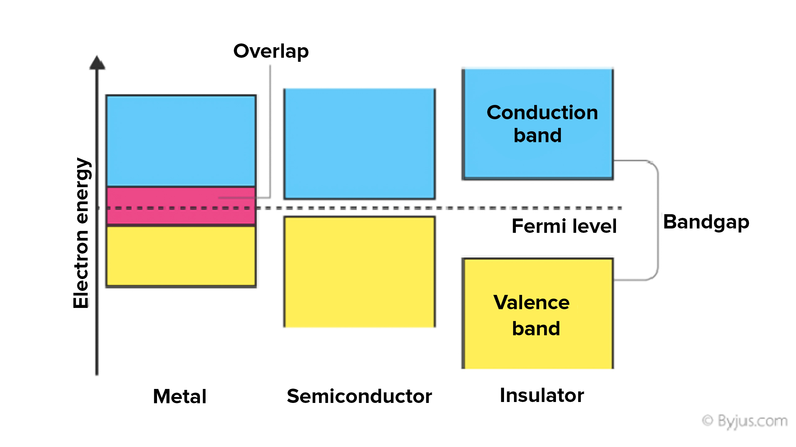
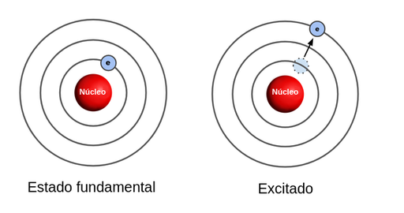

# Antecedentes
- 1880 Edison invento la bombilla, generando el "efecto Edison" ([emisión termoiónica](https://es.wikipedia.org/wiki/Emisi%C3%B3n_termoi%C3%B3nica)).
- 1897 **J. J. Thomson** 1856-1940 Se le acredita el descubrimiento del electrón.
- 1904 Fleming descubre el primer diodo de valbula de vacío.
- 1906 Lee De Forest controlo el flujo de corriente con una terminal.
# Conductores, Semiconductores y Aislantes
- El término **conductor** se aplica a cualquier metal que soporte un flujo generoso de carga, cuando una fuente de voltaje de magnitud limitada se aplica a través de sus terminales.
- Un **aislante $_{dielectricos}$** es un material que ofrece un nivel muy bajo de conductividad bajo la presión
# Constante de resistividad de los materiales
-> | R | = p$\frac{l}{A}$
A = area de la sección transversal
p = Constate de resistividad
l = longitud del objeto

| Conductor | Semi conductor | Aislantes |
|---|---|---|
|p=10$^{-6}\Omega cm$ (cobre)|p=50$\Omega cm$ (germanio)|p=10$^{-12}\Omega cm$(mica)|
||p=50x10$^{-3}\Omega cm$(silicio)||
# Teoréa de las Bandas De semiconductores
También conocido como Band Gap

Mientras más lejos este del núcleo, mayor energía.
## Niveles de energía
Dentro de la estructura atómica, cada átomo aislado tiene niveles de energía, asociados con cada capa  y electrón

### Electrón-Vol eV
V = $\frac{E}{q}$ 
> [!note] Electron Volt
> Dentro de esta formula tenemos que:
> 1eV = (1e$^-$)
> 1eV -> E
>  1e$^-$ -> q

Energía para separarse de su estructura atómica y entrar en la banda de conducción. Se obserará que la energía asociada con cada electrón se mide en electrón volts.

W = QV

W -> trabajo
Q -> Carga en coulombs

Podemos decir que:

W = QV = (1.6x10$^{-19}$C)(1V)
por lo tanto
1eV = 1.6x10$^{-19}$J

En resuen:

Tono esto viene de la [ecuación de schrodingers](004_Schrodinger's%20Formula.md)

aquí un ejemplo de la configuración de un elemento
