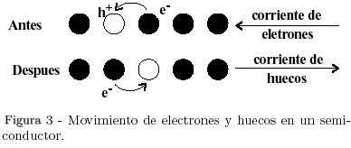
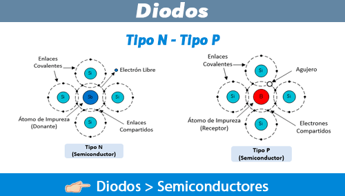

- **Silicio puro** es mal conductor.
- El máximo grado de pureza obtenido para el silicio es:
      $1\ parte\ por\ 10\ millones$
- Las impurezas agregadas lo vuelven más conductivo
- Grados de impureza:
    - 1 -> Grado metalurgico
    - 99.999% -> Grado electrónico o polar
## Tipos de semi conductores
- **Intrínsecos $puros$** Son aquellos sometidos a procesos de refinación para volverlos más puros.
- **Extrínsecos $impuros$** Son aquellos sometidos a procesos de contaminación o de *doping*  para volverlos más conductivos
- Doping Consiste de un proceso de contaminación o de "envenenamiento" o adición da los semiconductores para hacerlos conductivos
- Electrón libre Son aquellos electrones que han absorbido suficiente energía como para saltar a la banda de conducción y ser arrancados del átomo  padre
- Existen dos tipos de materiales, los tipos $n_{\ negativos}$ (portador mayoritarios electrones) y tipo $p_{\ positivos}$ (portador minoritarios electrones), esto se realiza contaminándolos con otros tipos de materiales **tri-valentes**.

## Portadores de carga
- Existen un concepto llamado **portador de carga** es cualquier elemento, partícula o entidad que transporta carga eléctrica dentro de un material o un sistema físico. Esto puede ser ya sea un electrón libre o huecos, dependiendo de la naturaleza del material. 
- **Ion donador** cuando un elemento que proporciona electrones adicionales a un material. 
