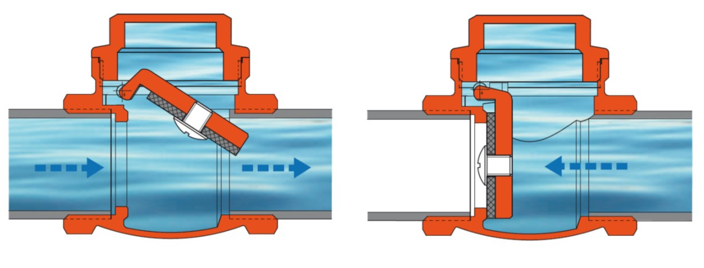
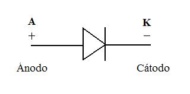
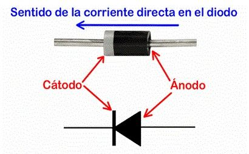
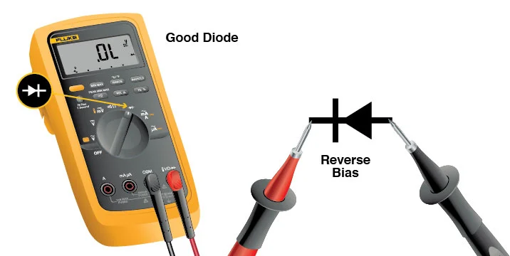
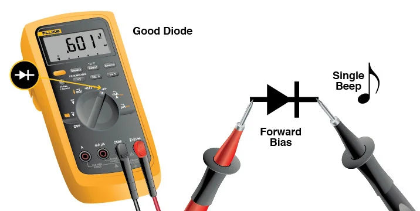
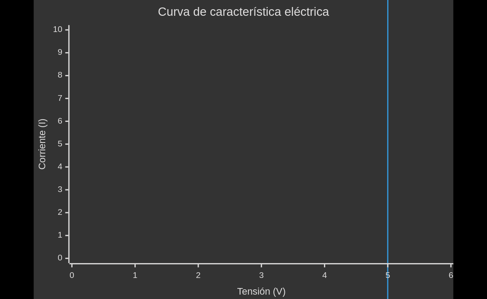
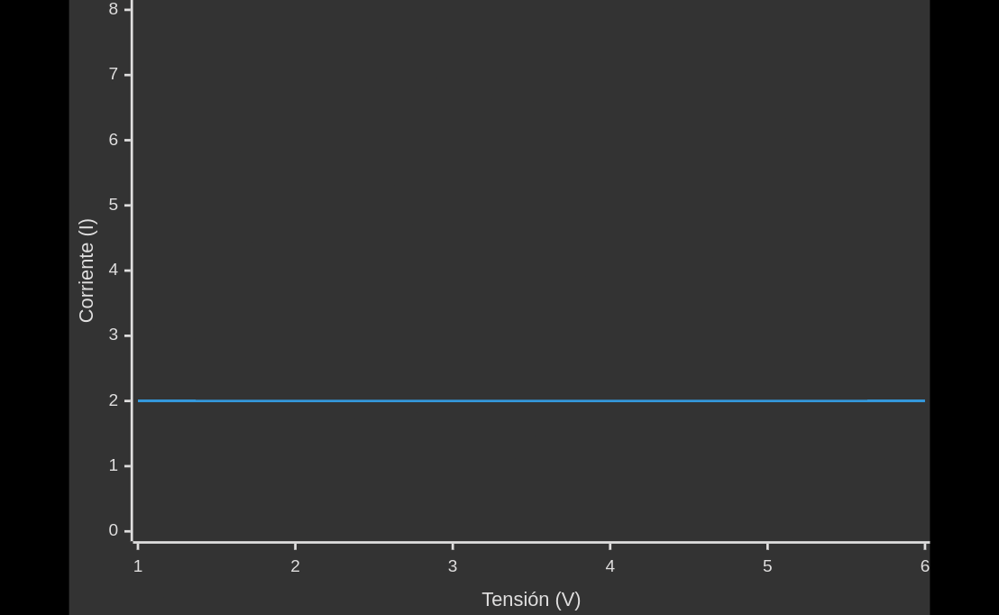
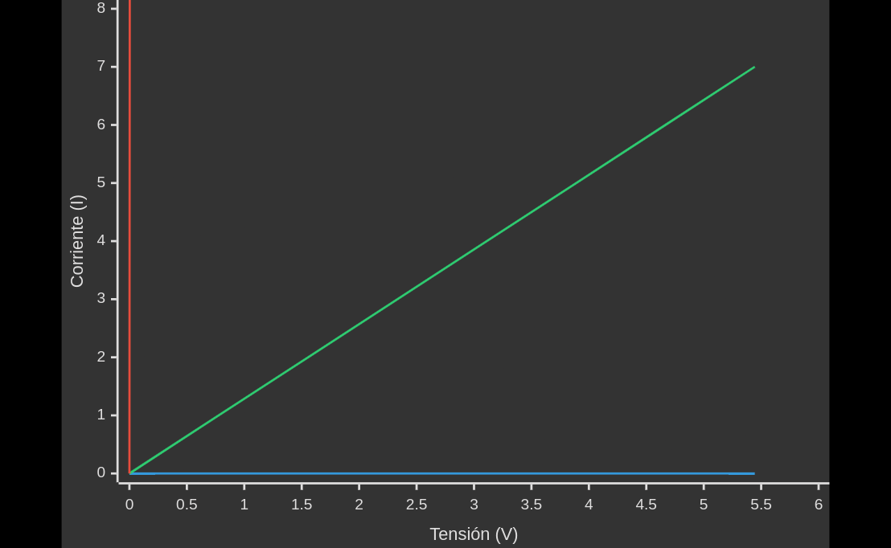

La analogía para un diodo es una válvula tipo check.

## Medicion

# Curva de característica eléctrica
## Fuente de voltaje

$$\large m=tan\alpha = \frac{\Delta y}{\Delta x} = \frac{y_2-y_1}{x_2-x_1} = \frac{I_2-I_1}{V_2-V_1} = \frac{\Delta I}{\Delta V}$$
$$\large R=\frac{V}{I} = \frac{\Delta V}{\Delta I} = \frac{1}{m}$$
$$\large R_{interna}=\frac{1}{\infty}=0\Omega$$

## Fuente de Intensidad

$$\large m=tan\alpha=tan0^{\circ}=0$$
$$\large R=\frac{1}{m} = \frac{1}{0}$$
## Resistencia

$$\large \text{Ley de Ohm: } R=\frac{V}{I}; I=\frac{V}{R}$$
 $$\large \text{En otras palabras: }I=\frac{1}{R}V \rightarrow y=mx$$
