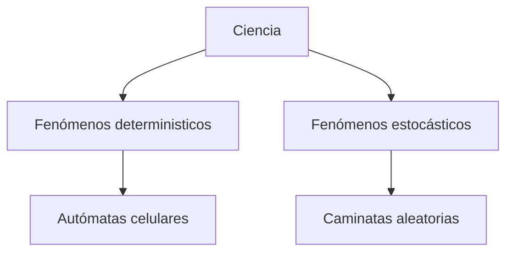
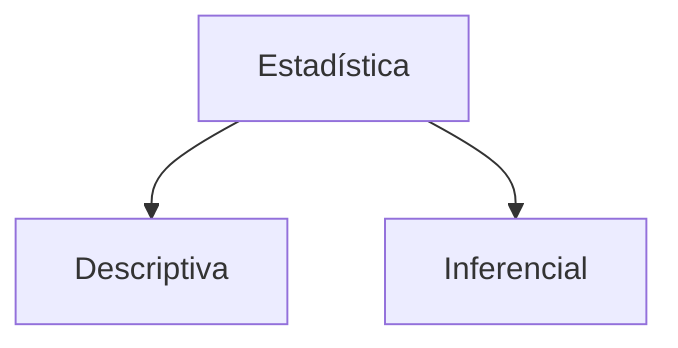
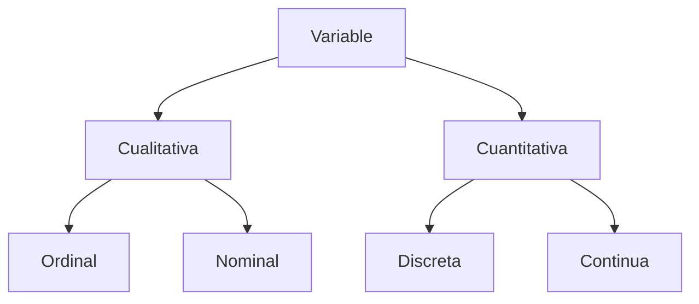

## Estadística

Es una ciencia formal que se ocupa de recolectar, organizar, analizar, interpretar y presentar datos variables para ayudar a la toma de decisiones.

> [!note] Autómata celular
>  Es un modelo matemático y computacional para un sistema dinámico que evoluciona en pasos discretos. Es adecuado para modelar sistemas naturales que puedan ser descritos como una colección masiva de objetos simples que interactúen localmente unos con otros.

> [!note] Caminata aleatoria
> Es una formalización matemática de la trayectoria que resulta de hacer sucesivos pasos aleatorios. Por ejemplo, la ruta trazada por una molécula mientras viaja por un líquido o un gas, el camino que sigue un animal en su búsqueda de comida, el precio de una acción fluctuante y la situación financiera de un jugador pueden tratarse como una caminata aleatoria.

## Población

Conjunto de elementos que comparten una determinada característica.

## Individuo

Cada uno de los elementos de la población.

## Muestra

Cualquier parte o subconjunto de individuos pertenecientes a la población.

## Parámetro

Es un valor numérico que representa una característica de una población.

## Estimador

Es un estadístico que se usa para predecir el valor de un parámetro.

## Estadístico

Valor numérico calculado a partir de una muestra.

mermaid
flowchart LR;
    A[Estadístico] -- Estimador --> B[Parámetro]

## Tipos de estadística

### Estadistica descriptiva

Conjunto de métodos para organizar, resumir y presentar los datos de manera informativa.

### Estadística inferencial

Conjunto de métodos utilizados para conocer algo acerca de una población basándose en la muestra.

## Variable

Algo que observamos o cuantificamos de los individuos de una población de interés.

## Variable cualitativa

Son variables que toman valores que corresponden a cualidades no cuantificables. A las variables cualitativas las dividimos en Ordinales y Nominales.

### Ordinales

Valores que tienen un orden específico, pero la distancia entre ellos no es uniforme.

### Nominales

Valores que representan categorías sin un orden inherente.

## Variable cuantitativa

Corresponden a conteos o mediciones. Las dividimos en Discretas y Continuas.

### Discretas

Valores contables y distintos, generalmente enteros.

### Continuas

Valores que pueden tomar cualquier número dentro de un rango, generalmente medibles en una escala continua.

