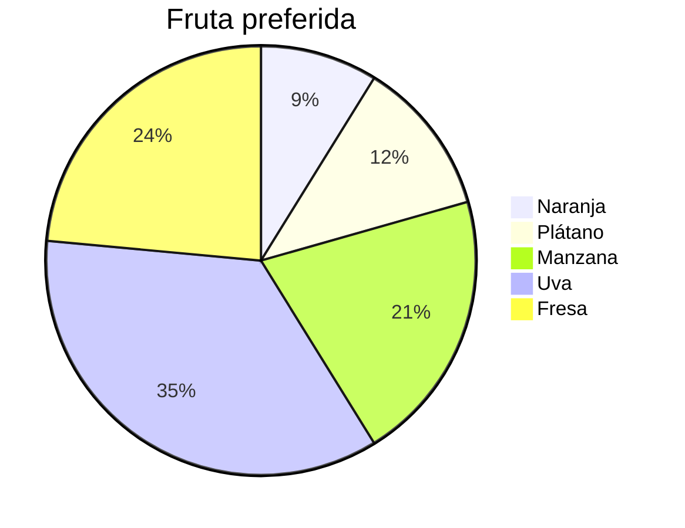

Los gráficos son *representaciones visuales* de un conjunto de *datos*. Los gráficos, tienen:
- **Título** Nos indica la información que representa el gráfico, y por lo regular, es similar al de una tabla de datos. $evitar\ el\ tipo\ de\ gráfico$
- **Cuerpo** Es la representación en si del *conjunto* de *datos*.
- **Escalas** Son la graduación y las etiquetas de los *ejes* $cuando\ existan$
- **Fuente o Descripción** Indica de donde provienen, o cómo se obtuvieron los datos. 
# Tipos de gráficos
## Barras
Es una representación para datos *categóricos* o *cuantitativos $discretos$*, en el cual se asocia a cada categoría una barra de altura proporcional $la\ anchura\ no\ importa$ a algunas de las frecuencias $relativas\ o\ absolutas$.

Se suelen poner las *barras* separadas unas de las otras, que va a ser una diferencia que se verá con respecto al *histograma*.
### Pictograma
Como casos especiales de un gráfico de barras, se tiene a los pictogramas; en los que, en lugar de barras se utilizan figuras de altura proporcional a la frecuencia. Para lograrlo primero se escogen figuras alusivas al tema, se recomienda que todas las figuras sean del mismo tamaño.
Y estas se alargan de manera que llegue a la altura requerida o se repite hasta alcanzar la altura necesaria. En este caso, la figura de hasta arriba, puede aparecer mutilada
## Gráfico de sectores o $Pastel$
Un gráfico de sectores o de $pastel$ es un gráfico basado en un circulo (Representa a la totalidad de los datos) y expresa de manera gráfica la distribución proporcional de los eventos o datos en estudio.
> [!warning] Barras y Pastel
> - Estos gráficos no se recomiendan  cuando hay muchas categorías.
> - No se recomienda agregar efectos 3D o perspectiva. 
> - Si hay muchas categorías, sobre todo de poca frecuencia,  se pueden agrupar en 1 sola que se llamen otras o varias.
> - En el gráfico de **sectores** se deben de mostrar de forma explicita, los conteos o porcentajes de cada categoría, ya sea dentro del gráfico, o en una leyenda.
# Ejercicio
En la siguiente tabla se muestran los datos correspondientes a la fruta preferida de los alumnos del grupo 6$^{to}$-C

|Fruta preferida| N. Alumnos |
| --- | :-: |
| Naranja | 3 |
| Plátano | 4 |
| Manzana | 7 |
| Uva | 12 |
| Fresa | 8 |

Elabore un gráfico de barras, un pictograma y un gráfico de sectores para representar los datos.

Solución

