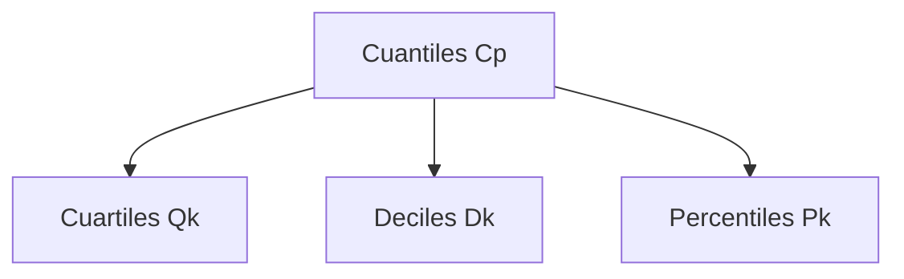

Los cuantiles son ciertos valores que permiten dividir el un conjunto de datos ordenados en partes iguales. Se llaman medidas de posición porque, al igual que la mediana, tienen en cuenta la posición (Relativa) de los valores en la muestra ordenada.

Los cuantiles mas usados son los cuartiles, los deciles y los percentiles.

El cuantil $C_p$ es un valor tal que el $p\times 100\%$ de los datos son menores o iguales que dicho valor, esto para $p \in [0,1]$.

## Cuartiles

Los cuartiles dividen un conjunto de datos ordenados en cuatro partes, cada una con al menos un 25% de los datos, es decir, puede haber datos que se repitan en los cuartiles.

$$Q_k = C_{\frac{k}{4}}$$

## Deciles

Los deciles dividen un conjunto de datos ordenados en diez partes, cada una con al menos un 10% de los datos, es decir, puede haber datos que se repitan en los deciles.

$$D_k = C_{\frac{k}{10}}$$

## Percentiles

Los percentiles dividen un conjunto de datos ordenados en cien partes, cada una con al menos un 1% de los datos, es decir, puede haber datos que se repitan en los percentiles.

$$P_k = C_{\frac{k}{100}}$$

## Pasos para calcular el $C_p$

1. Ordenar los datos de menor a mayor.
2. Calcular $r = p \times (n-1) + 1$.
3. Determinar de $r$ la parte entera $\square r$ y decimal $\triangle r$.
4. Usamos la fórmula $C_{p} = (1 - \triangle r) \times X_{(\square r)} + \triangle r \times X_{(\square r + 1)}$.

## Ejemplo: Calculando el $C_p$

Para los siguientes datos:

| 1   | 7   | 4   | 12  | 11  | 1   | 21  | 2   | 6   | 1   | 14  | 12  |
| --- | --- | --- | --- | --- | --- | --- | --- | --- | --- | --- | --- |

Calcule:
| $C_{0.67}$ | $Q_{1}$| $D_{8}$| $P_{42}$|
| :--------: | :----: | :----: | :-----: |

1. Ordenar los datos de menor a mayor.

- 1 1 1 2 4 6 7 11 12 12 14 21

### Para $C_{0.67}$

1. Calcular $r$

- $p = 0.67$
- $r = 0.67 \times (12-1) + 1 = 8.37$

2. Determinar de $r$ la parte entera $\square r$ y decimal $\triangle r$.

- $\square r = 8$
- $\triangle r = 0.37$

3. Usamos la fórmula $C_{p}$

- $C_{0.67} = (1 - 0.37) \times 11 + 0.37 \times 12 = 11.37$

### Para $Q_{1}$

1. Calcular $r$

- $p = \frac{1}{4} = 0.25$
- $r = 0.25 \times (12-1) + 1 = 3.75$

2. Determinar de $r$ la parte entera $\square r$ y decimal $\triangle r$.

- $\square r = 3$
- $\triangle r = 0.75$

3. Usamos la fórmula $C_{p}$

- $Q_{1} = (1 - 0.75) \times 1 + 0.75 \times 2 = 1.75$

### Para $D_{8}$

1. Calcular $r$

- $p = \frac{8}{10} = 0.8$
- $r = 0.8 \times (12-1) + 1 = 9.8$

2. Determinar de $r$ la parte entera $\square r$ y decimal $\triangle r$.

- $\square r = 9$
- $\triangle r = 0.8$

3. Usamos la fórmula $C_{p}$

- $D_{8} = (1 - 0.8) \times 12 + 0.8 \times 12 = 12$

### Para $P_{42}$

1. Calcular $r$

- $p = \frac{42}{100} = 0.42$
- $r = 0.42 \times (12-1) + 1 = 5.62$

2. Determinar de $r$ la parte entera $\square r$ y decimal $\triangle r$.

- $\square r = 5$
- $\triangle r = 0.62$

3. Usamos la fórmula $C_{p}$

- $P_{42} = (1 - 0.62) \times 4 + 0.62 \times 6 = 5.24$

## Ejemplo: Comprobación $C_{0.5} = \tilde{x}$

Queremos comprobar:

$$ C*{0.5} = Q*{2} = D*{5} = P*{50} = \tilde{x}$$

### Cuando $n$ es impar

1. Calcular $r$

- $p = 0.5$
- $r = 0.5 (n-1) + 1$
- $r = 0.5 n - 0.5 + 1$
- $r = 0.5 n + 0.5$

2. Determinar de $r$ la parte entera $\square r$ y decimal $\triangle r$.

- $\square r = 0.5 n + 0.5$
- $\triangle r = 0$

3. Usamos la fórmula $C_{p}$

- $C_{0.5} = (1 - 0) \times X_{(0.5 n + 0.5)} + 0 \times X_{(0.5 n + 0.5 + 1)}$
- $C_{0.5} = X_{(0.5 n + 0.5)}$
- $C_{0.5} = X_{(\frac{n+1}{2})}$
- $C_{0.5} = \tilde{x}$

### Cuando $n$ es par

1. Calcular $r$

- $p = 0.5$
- $r = 0.5 (n-1) + 1$
- $r = 0.5 n - 0.5 + 1$
- $r = 0.5 n + 0.5$

2. Determinar de $r$ la parte enter
   a $\square r$ y decimal $\triangle r$.

- $\square r = 0.5 n$
- $\triangle r = 0.5$

3. Usamos la fórmula $C_{p}$

- $C_{0.5} = (1 - 0.5) \times X_{(0.5 n)} + 0.5 \times X_{(0.5 n + 1)}$
- $C_{0.5} = \frac{X_{(0.5 n)} + X_{(0.5 n + 1)}}{2}$
- $C_{0.5} = \frac{X_{(\frac{n}{2})} + X_{(\frac{n}{2} + 1)}}{2}$
- $C_{0.5} = \tilde{x}$