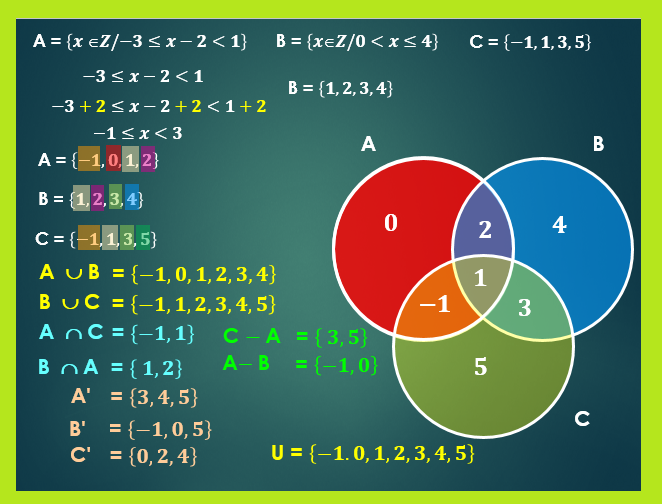

Un elemento puede pertenecer o no pertenecer a un conjunto.    

$$\large a\in A$$    

$$\large a\notin A$$   

$$\large a\subset B$$   

$$\large A\cap B$$   

$$\large A\cup B$$   

$$\large A-B\ a/B$$  

$$\large A^c=A'=\bar{A}$$  

## Propiedades
Se tienen las siguientes propiedades para conjuntos:
- La unión e intersección de eventos son operaciones conmutativas:
      $\large A\cup B\ =\ B\cup A$   
      $\large A\cap B\ =\ B\cap A$
- La unión e intersección de eventos son operaciones asociativas:
      $\large (A\cup B)\cup C\ =\ A\cup (B\cup C)$  
      $\large (A\cap B)\cap C\ =\ A\cap (B\cap C)$  
- Se verifica la distribuidad de cada operación respecto a la otra:
      $\large A\cap (B\cup C)\ = \ (A\cap B)\cup (A\cap C)$  
      $\large A\cup (B\cap C)\ = \ (A\cup B)\cap (A\cup C)$  
- El operado de complemento verifica:
      $\large A\cap A^c\ = 0$
      $\large A\cup A^c\ = \Omega$
      $\large \Omega ^c\ =\ 0$
      $\large \Theta ^c\ =\ 0$
      $\large (A^c)^c\ =\ A$
      $\large A-B\ = A\cap B^c$
- Se cumplen las llamadas leyes de morgan:
      $\large (A\cap B)^c\ =\ A^c\cup B^c$
      $\large (A\cup B)^c\ =\ A^c\cap B^c$
-  [Propiedades de Axioms de Kolmogorov](009_Axiomas_Kolmogorov.md#Propiedades)
- [Probabilidad Restringida](008_Probabilidad.md#Restringida)
- [Independencia (estadística)](008_Probabilidad.md#Independencia%20(estadística))
      
## Eventos especiales
En probabilidad, a los conjuntos y  subconjuntos les llamamos *eventos*. Los *eventos* especiales son:
- Eventos simples:
      Tienen un único elemento.
- Eventos compuestos:
      Tienen dos o más elementos.
- Evento imposible:
    Vacío
- Espacio muestral $\tiny evento universal$:
      $\large \Omega$

Los tipos de **espacios muestrales** son:
- **Finitos**: tienen fin
- **Infinitos**
    - *Numerables*: se pueden contar $\tiny\text{cuantos volados se deben hacer para que salga determinado valor}$.
    - *No numerables*: infinitas posibilidades $\tiny\text{distancia que queda una moneda en el juego de la rayuela}$.  

