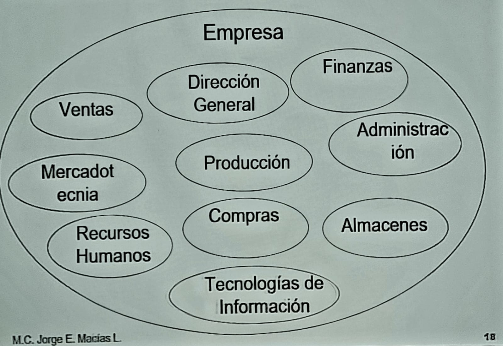
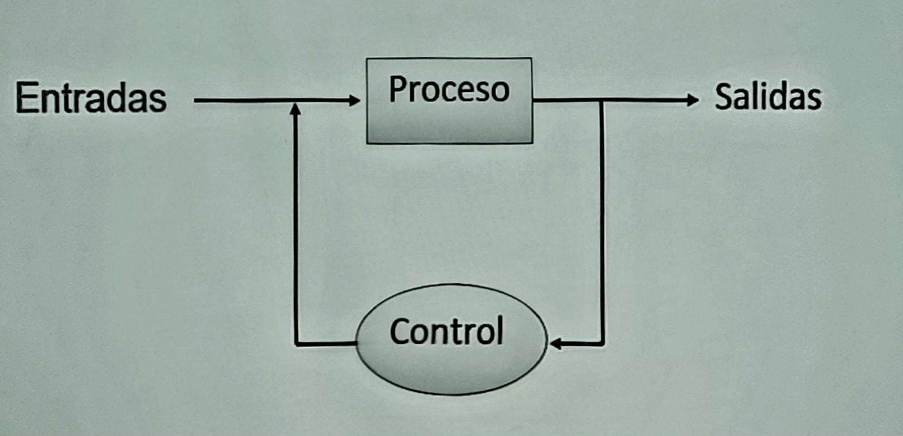
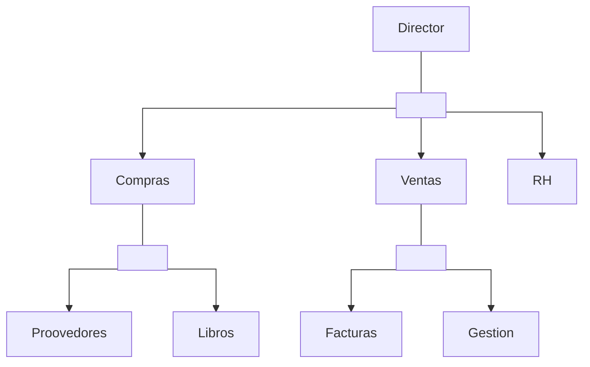

## Definición
- Conjunto de componentes que interaccionan entre si para lograr uno o más objetivos en común.
- Ejemplo de sistema:
    - Cuerpo Humano
    - Organización/Empresa
    - Sistema Económico
    - Sistema Operativo
    - Sistema de Base de Datos
## Componentes de un sistema

## Elementos de un sistema

- **Entrada**  Característica de un cliente.
- **Proceso** Altas, bajas, modificación.
- **Control** Validación  y y adecuación de los datos del cliente/sistema.
- **Salida** Reflejo. consultas o mandar a imprimir (*reporte*)

### El organigrama
La estructura organizacional determina el **organigrama**, este presenta una estructura jerárquica, la cual es una  representación gráfica de los componentes.
Ejemplo  jerarquico:

Para poder desarrollar un sistema de información, se tiene que empezar desde la parte más inferior del organigrama.

$identificar entradas y caracteristicas de procesos$

Por ejemplo, empezando desde abajo:
- Proveedor: Teléfono, nombre,  dirección, RFC, correo electrónico, CURP
    - Altas: 
        - Proveedor no se repite
        - Clave de proveedor es numérico
    - Bajas
    - Cambios
    - Consultas
    - Reportes
- Dirección:
    - Calle
    - Número exterior
    - Número interior
    - Colonia
    - Código Postal
    - Zona Postal
    - Delegación
    - Municipio
    - Estado
    - País
1. Entradas
    - Características de las entradas
    - Requerimientos
2. Procesos
    - Altas
    - Bajas
    - Cambios
    - Consultas
    - Reportes
3. 