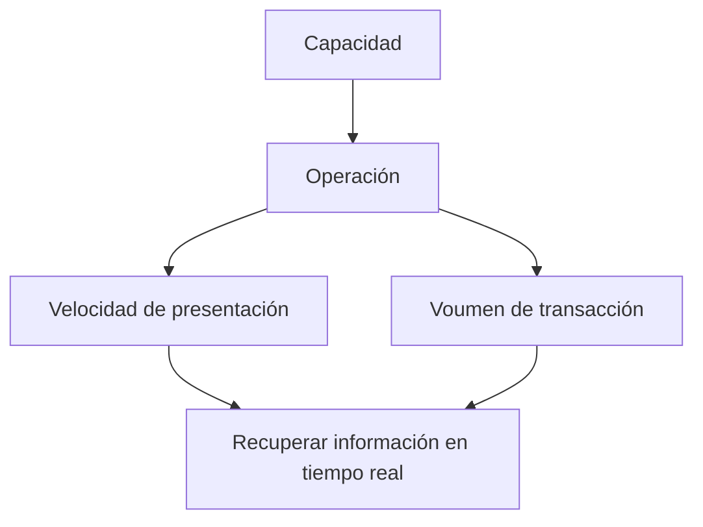

- **Capacidad**.  
La capacidad de un sistema de información se refiere a la *capacidad de información* que puede manejar y la velocidad que puede procesar.  

> [!note] Respaldos  
> Es una buena práctica el generar respaldos de manera correcta.  
  
- **Comunicación**.  
    - Comunicación efectiva.    
    - Comunicación en tiempo real.   
    - Horizontal | vertical.  
La comunicación entre el cliente y el ingeniero en sistemas es vital para el éxito del sistema.
- **Competitividad**.   
    - Estrategia.  
    - Competencia por información.   
En la competitividad hay que ser  capaces de analizar la competencia, poder visualizar.

- **Control**.  
- **Costo**.  

