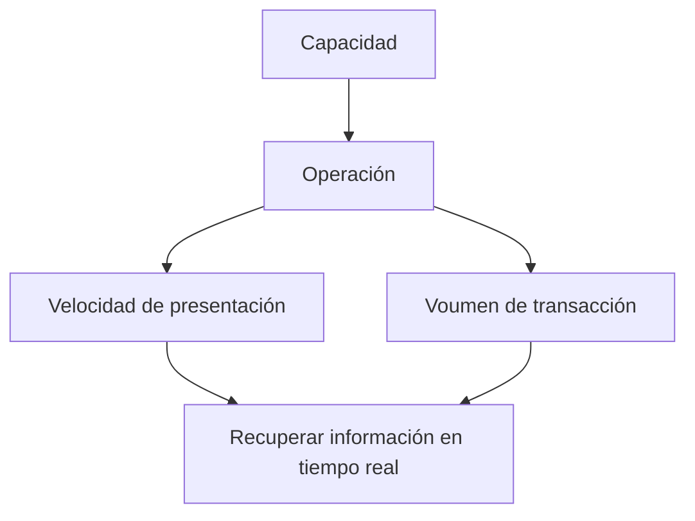

- **Capacidad**.  
La capacidad de un sistema de información se refiere a la *capacidad de información* que puede manejar y la velocidad que puede procesar.  

> [!note] Respaldos  
> Es una buena práctica el generar respaldos de manera correcta.  
  
- **Comunicación**.  
    - Comunicación efectiva.    
    - Comunicación en tiempo real.   
    - Horizontal | vertical.  
La comunicación entre el cliente y el ingeniero en sistemas es vital para el éxito del sistema.
- **Competitividad**.   
    - Estrategia.  
    - Competencia por información.   
    - Contar con la información en tiempo y forma para tomar decisiones adecuadas.
En la competitividad hay que ser  capaces de analizar la competencia, poder visualizar.
Un buen S.I aumenta la competitividad mediante:
- Atraer y mantener clients
- **Control**.  
    El control en un S.I se relaciona a que la información tenga consistencia, tengamos seguridad en la función de información.
    Es importante mantener la seguridad de los datos importantes y sensibles en una forma que sean accesibles.  
- **Costo**.  
    Es importante conocer y tener control sobre los costos. los S.I relacionan con este rubro mediante:  
    - Vigilancia de los costos:  mano de obra, bienes, instalaciones, productos, materia prima. etc.
    - Reducción de costos: Eliminar errores, procesar datos con costo menor, mantener exactitud y niveles de desempeño.
    - Evitar vender debajo del costo.
